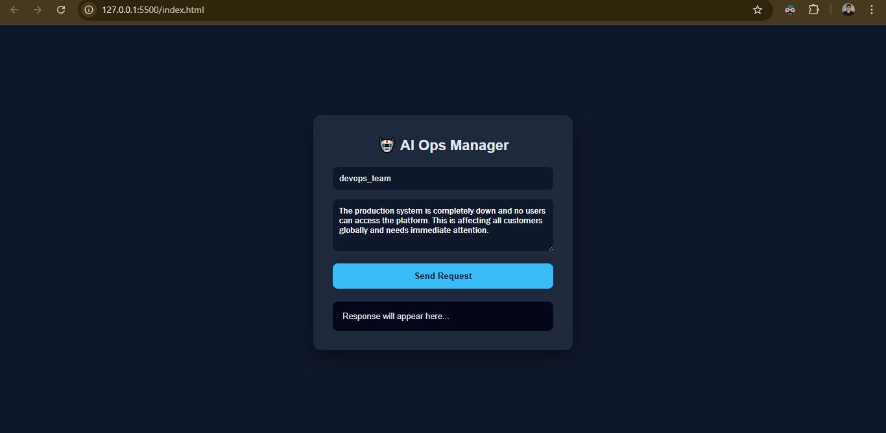
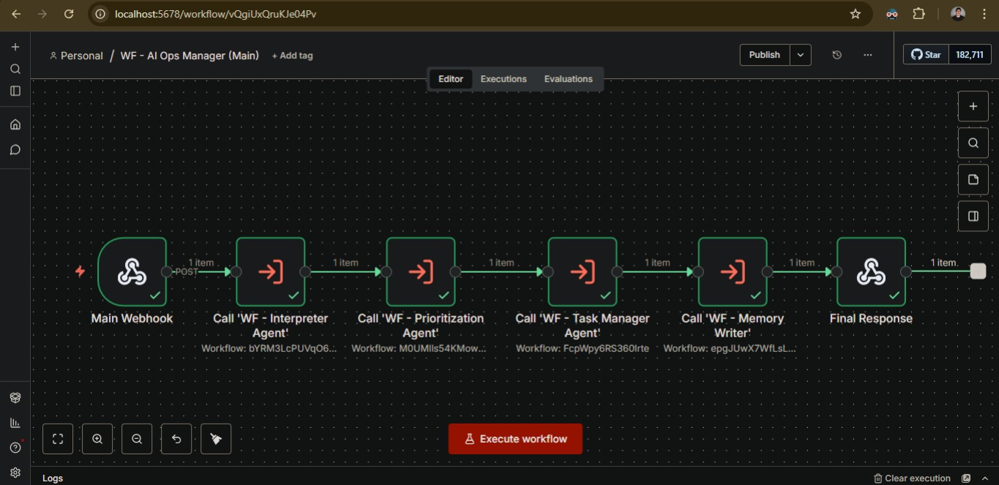
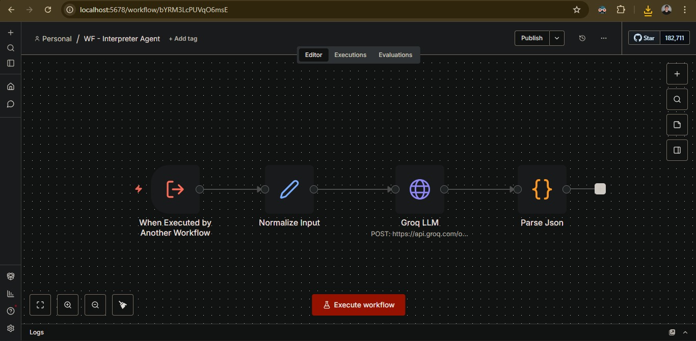
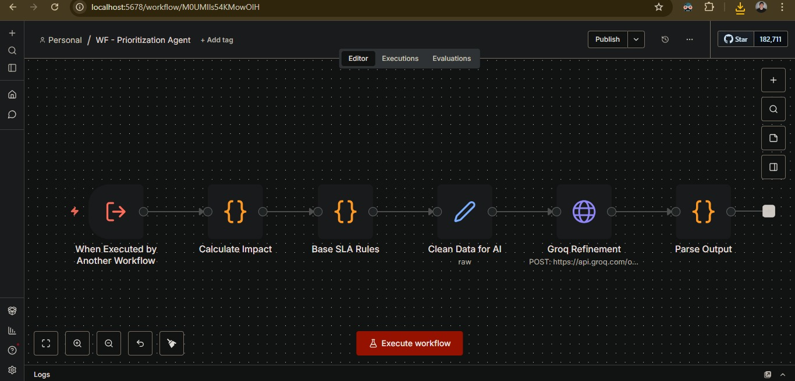
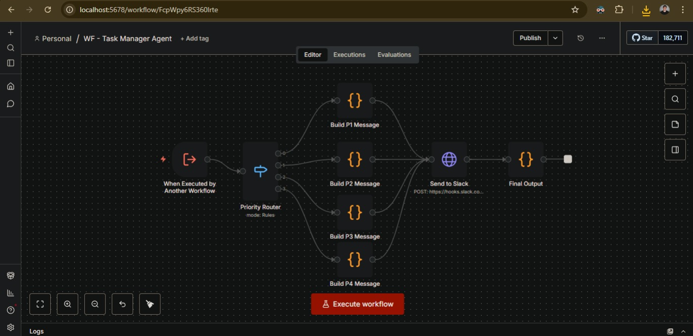
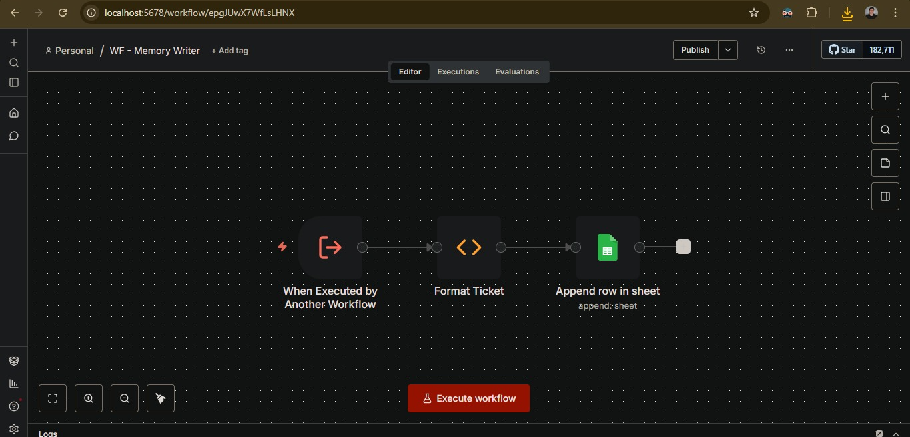
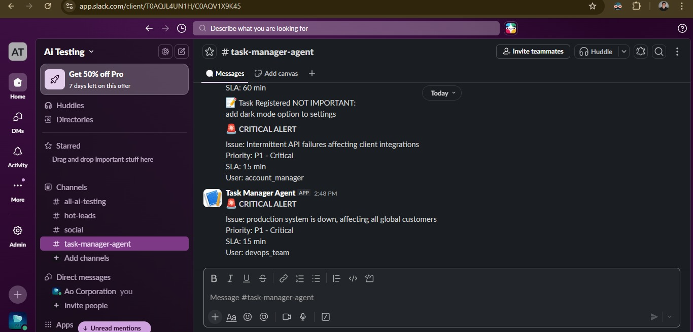
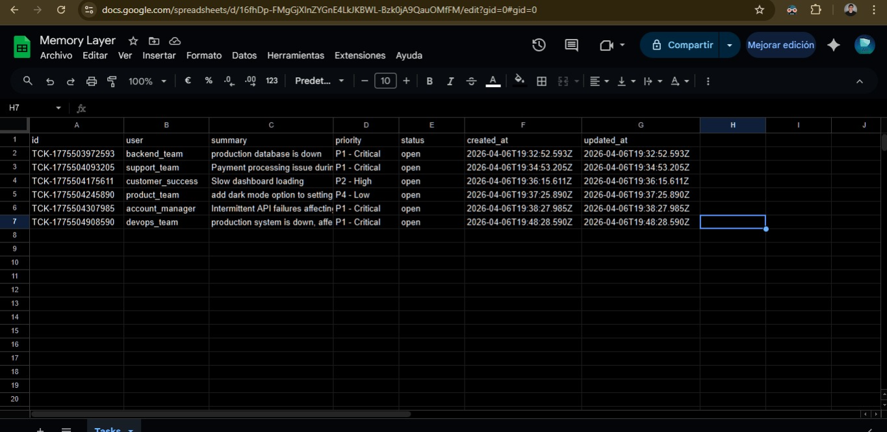
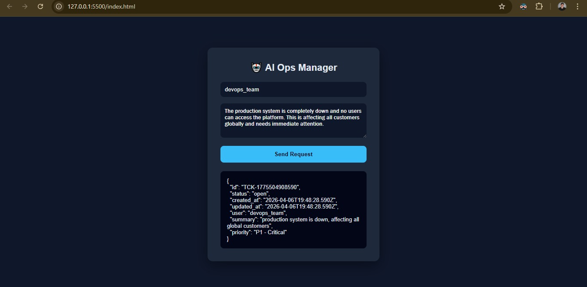

# 🚀 AI Autonomous Operations Manager (n8n-Based)

## 🧠 Overview

This project is a **multi-agent AI system built with n8n** that autonomously manages internal operations.

It simulates an intelligent operations manager capable of:
- analyzing incoming requests
- prioritizing tasks based on business impact
- executing actions in real time
- storing and tracking tasks

The system combines:
- LLMs (via Groq)
- workflow automation
- modular agent-based architecture

---

## ⚙️ System Architecture

The system is composed of independent workflows (agents) orchestrated by a main workflow:

Main Workflow (Orchestrator)
├── Interpreter Agent
├── Prioritization Agent
├── Task Manager Agent
└── Memory Writer

---

## 🔹 1. Main Workflow (Orchestrator)

Handles incoming requests via webhook and coordinates all agents.

### Flow:
1. Receives request
2. Sends to Interpreter Agent
3. Sends output to Prioritization Agent
4. Executes Task Manager
5. Stores task in Memory Layer
6. Returns structured API response

---

## 🤖 2. Interpreter Agent

Uses Groq LLM to analyze incoming text and convert it into structured data.

### Responsibilities:
- Extract intent
- Detect category (technical, billing, etc.)
- Determine urgency
- Generate summary
- Decide if action is required

### Output Example:
```json
{
  "intent": "report_issue",
  "category": "technical",
  "urgency": "critical",
  "summary": "Database outage",
  "requires_action": true
}
```

---

## ⚖️ 3. Prioritization Agent

Applies SLA-based business logic + AI refinement using Groq.

## SLA Rules:
- P1 → 15 minutes
- P2 → 60 minutes
- P3 → 240 minutes
- P4 → 1440 minutes

## Features:
- Impact calculation
- Rule-based prioritization
- AI refinement with strict constraints

## Output Example:
```json
{
  "priority": 1,
  "priority_label": "P1 - Critical",
  "sla_minutes": 15,
  "impact": "high",
  "reasoning": "System outage affecting multiple users"
}
```

---

## ⚡ 4. Task Manager Agent

Executes real actions based on priority.

## Responsibilities:
- Route tasks based on priority
- Send real-time alerts via Slack
- Format operational messages

## Behavior:
- P1 → 🚨 Critical alert
- P2 → ⚠️ High priority notification
- P3 → 📝 Task queued
- P4 → 📦 Low priority backlog

---

## 🗄️ 5. Memory Layer (Task Tracking)

Stores tasks in Google Sheets as a lightweight database.

## Stored Data:
- Task ID
- User
- Summary
- Priority
- Status
- Timestamps

## Example:
```json
{
  "id": "TCK-171234567",
  "user": "support_team",
  "summary": "API failure",
  "priority": "P2 - High",
  "status": "open"
}
```

---

## 🧪 Example Use Cases
- Incident management
- Internal request automation
- Customer support triage
- Operations monitoring
- AI-driven ticketing systems

---

## 🧱 Tech Stack
- n8n – workflow orchestration
- Groq – LLM inference
- Slack – notifications
- Google Sheets – memory layer

---

## 🚀 Key Features
- 🧠 Multi-agent AI architecture
- ⚖️ SLA-based prioritization
- ⚡ Real-time execution
- 🗄️ Persistent memory layer
- 🔌 API-first design
- 🔄 Fully modular workflows

---

## 👨‍💻 Author

Built by Steve — focused on AI systems, automation, and building the future 🚀

---

## Interface Images

















